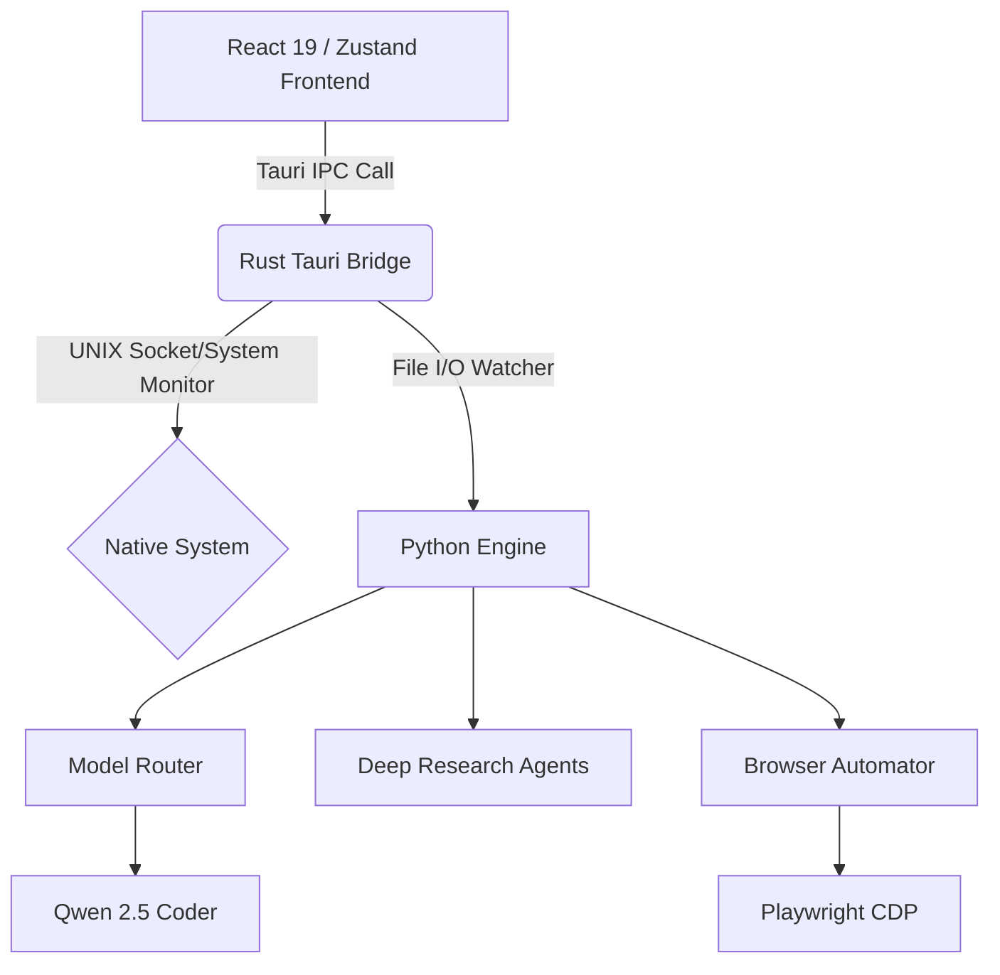

<div align="center">
  
  <h1>ARIA v8.0<br/>Enterprise Context Engine</h1>
  <p><strong>The Ultimate Distributed Autonomous Intelligence Desktop Environment</strong></p>
  
  [](https://github.com/GamerX3560/Aria-V-7.1)
  [](https://tauri.app)
  [](https://reactjs.org)
  [](https://python.org)
  [](https://archlinux.org/)
</div>

<br/>

> **ARIA (Antigravity Research Intelligence Assistant)** has evolved from a simple Python CLI tool into a fully distributed, multi-agent AI operating environment. Version 8.0 introduces the **Enterprise Desktop Manager**, a Google Cloud-grade Tauri/React frontend providing unparalleled control over 18 autonomous subsystems, real-time memory contexts, and the dynamic skill matrix.

---

## ⚡ Executive Summary & Innovations

ARIA v8.0 is a complete rewrite of the intelligence backend coupled with a massive GUI front-end overhaul. It is designed to run entirely locally, maximizing privacy and leveraging local hardware (e.g., AMD ROCm architecture, Wayland/Hyprland ecosystems). 

### Major Features
1. **Enterprise Desktop Manager (GUI):** Built on Tauri 2.0 and React 19, featuring sub-millisecond Rust IPC bridges, glassmorphic UI, and 14 independent control panels spanning telemetry to active agent orchestration.
2. **Infinite Execution Loop:** `agent_loop.py` features a highly advanced, self-healing execution engine. It tracks its own consecutive failures, avoids duplicate error traps, and utilizes a "stuck detection" guard that breaks infinite loops intelligently.
3. **Multi-Modal Deep Research (v4):** The `deep_research_v4.py` agent acts as a crawler with 6 sequential deep-dive stages: GitHub API search, Awesome Lists integration, DuckDuckGo multi-page crawls, Reddit/Hackernews scrapes, Arch Wiki extraction, and triple-pass LLM distillation.
4. **Context Injection Engine:** ARIA intercepts local user data (`~/.personal_data/`, OCR'd screenshots, PDFs) and merges them seamlessly with active RAG DB (ChromaDB) retrievals to assemble perfectly contextual prompts prior to inference.
5. **Zero-Shot System Integration:** Full manipulation of Arch Linux environments (via Wayland, PipeWire, `systemd`, `ydotool`) without human supervision. 

---

## 🏗️ Advanced Architecture

ARIA is partitioned into four distinct operational layers connected via IPC commands and UNIX sockets.



### Layer 1: React + Zustand Presentation (The GUI)
The `/aria-enterprise` dashboard orchestrates state via a global `useAriaStore.js`. Data is polled exactly every 2000ms natively. The UI is built using plain CSS modules emphasizing frosted glass, dark-mode styling, and instantaneous updates across all charts (Recharts) and widgets.

### Layer 2: Rust Tauri IPC Bridge
The frontend does **not** rely on slow HTTP Python servers. Instead, `/src-tauri/src/lib.rs` provides direct memory and CPU pointers (`sysinfo`), reads logs directly from systemd using `journalctl`, and executes system commands through native Rust bindings.

### Layer 3: Python Intelligence Core
The core Python engine manages inference routing, context loading, and task orchestration:
- **`core/agent_loop.py`:** Evaluates LLM outputs, executes shell commands via `asyncio.to_thread` to prevent GIL locks, and tracks `_executed_commands` to prevent duplicate action starvation.
- **`core/rag_memory.py`:** Leverages ChromaDB local embeddings. Pushes continuous interactions into episodic storage and long-term memory retrieval pipelines.
- **`core/model_router.py`:** Intelligently switches models (e.g. smaller 7B models for validation, 32B models for reasoning) based on internal load metrics.

### Layer 4: Capability Exoskeleton (Skills)
Tools dynamically augment ARIA's reach. The `skills/` directory houses specialized agents ranging from **Clipboard Management** (Wayland) to **Speech-to-Text** (Whisper). ARIA dynamically parses the AST of these scripts on runtime.

---

## 🔍 Module Deep-Dive

### The Execution Loop (`agent_loop.py`)
At the heart of ARIA lies an infinite autonomous loop ensuring tasks are seen to completion:
*   **Duplicate Detection:** `code_stripped in self._executed_commands`. If ARIA attempts a failed bash command identically twice, the engine intervenes, injecting a cognitive correction prompt (`OBSERVATION: You already ran this exact command`).
*   **Failure Thresholds:** `MAX_CONSECUTIVE_FAILURES = 5`. If an agent is stuck, it deliberately aborts the sub-routine and asks the human operator via a `[ASK]` tag.
*   **Safe Code Extraction:** Employs precise RegEx masking to parse generated bash, python, or JS segments out of raw LLM streams while discarding markdown padding.

### Multimodal Deep Research Router (`deep_research_v4.py`)
A masterclass in OSINT aggregation. Unlike basic search implementations, `v4` acts like a synthetic human analyst:
1.  **Stage 1 (GitHub API):** Specifically filters for recent repositories (`pushed:>2023-01-01`), avoids generic massive repos (`stars:<100000`), and scrapes the first 25 repository `README.md` files.
2.  **Stage 2 (Awesome Lists):** Programmatically queries `awesome {topic}` on GitHub, fetching curated markdown indices and extracting their hyperlinked repositories automatically.
3.  **Stage 3 & 4 (DDG & Reddit):** Falls back to raw `DynamicFetcher` HTML scraping when APIs rate-limit, utilizing `trafilatura` to extract the dense semantic article cores while dropping headers/footers.
4.  **Stage 5 (Personal Intercept):** Hooks into the local `~/.personal_data` directory, running `pytesseract` OCR on images and `fitz` (PyMuPDF) on local documents, injecting your private context into the research synthesis.

---

## ⚙️ Enterprise Dashboard Domains

The `aria-enterprise` GUI covers 12 dedicated operation panels. 

### 1. Command Center
The tactical overview. Displays Recharts visualizations of your AMD Ryzen CPU cores, memory swap utilization, and active task loads. Features quick-actions to flush RAG context, restart the underlying `systemd` daemon, or wipe temporary context. 

### 2. Agent Foundry
Create, clone, and kill autonomous sub-agents. You can visually alter their maximum token thresholds, update their system prompts dynamically, and see exact activity state indicators (`IDLE`, `THINKING`, `EXECUTING`). 

### 3. Skill Matrix
A real-time visualizer of the `skills/` directory. Rather than reloading the daemon to add functionality, use the inline Monaco Code Editor to live-script Python tools. ARIA will automatically identify syntax validity and add the tools to its schema parameters. 

### 4. Context Core & Telemetry
- **Telemetry:** Built as a pseudo-terminal streaming local Rust IPC `journalctl` lines up to 500 lines deep. Auto-scrolls and color-codes `INFO`, `WARN`, and `ERROR` outputs natively. 
- **Context Core:** Direct access to `memory.json`. Edit the exact key-value facts that ARIA remembers about you, your workflows, or your preferences. 

### 5. Security & Vault
The paranoid environment configuration. Use the Vault to edit API keys which are stored securely out-of-git. Configure the Sudo Lock which explicitly monitors and blocks `rm -rf`, `chown`, and root-level commands executing physically on the Arch host without two-factor approval. 

---

## 🚀 Installation & Deployment

As ARIA v8 relies heavily on the Tauri backend, the setup requires specific toolchains.

### 1. Dependency Prerequisites
```bash
# Arch Linux System Requirements
sudo pacman -S base-devel rust cargo nodejs npm jq \
               webkit2gtk tesseract tesseract-data-eng \
               chromium poppler curl
```

### 2. Core Python Intelligence
ARIA operates exclusively in Python 3.12+ virtual environments. 
```bash
git clone https://github.com/GamerX3560/Aria-V-7.1.git aria
cd aria

# Install dependencies (requires pip)
pip install -r requirements.txt
playwright install --with-deps chromium

# Initialize the daemon background worker
bash setup.sh
```

### 3. Desktop UI Compilation (Tauri Rust)
```bash
cd aria-enterprise

# Install all Vite/React modules
npm install

# Start the developer debug GUI (hot reloading capabilities)
npx tauri dev

# Compile the final native Release Binary (for deployment to standard usage)
npx tauri build
```
Once the final build concludes, your optimized binary will be located in `/aria-enterprise/src-tauri/target/release/app`. You can link this executable to a `.desktop` shortcut for seamless system integration.

---

## 🛡️ Security Footprint

ARIA ensures maximum user safety.
- **Git-Ignored Keys:** Token configurations are stored solely in `vault/credentials.json` which is aggressively excluded by `.gitignore` checks.
- **Non-Nvidia Hardware:** Built to operate out-of-the-box utilizing CPU or OpenCL/ROCm architectures without failing when missing CUDA.
- **Execution Sandboxing:** Sub-agents evaluate shell scripts in temporary user environments separated from high-privilege host sectors.

---

<div align="center">
<i>"Intelligence is the ability to adapt to change. ARIA forces the change."</i><br/>
<b>Maintained exclusively by GamerX3560</b>
</div>
